<p align="center">
  
</p>
## **Introduction**
***
DukePro(f) is a schedule-planning desktop application that assists **university professors** in managing
their **consultations**, through the usage of an intuitive **Command-Line Interface (CLI)**<sup>1</sup>
and an easy-to-navigate **Graphical User Interface (GUI)**<sup>2</sup>.

It is named `DukePro(f)` (Duke-Professor) because our project's target audience is professors, and it is also a nod
to our CS2103T iP (individual Project), which was named `Duke`.

Amidst long hours of lectures and tutorials in the week, professors may still need to cater timeslots for student
consultations, which can be hard to come by and difficult to keep track of. This is where Dukepro(f)
comes in to help you out!

With DukePro(f), you will be able to:

* Add, edit, and delete your consultations
* List all of your consultations, or just your next consultation
* List your free time slots for consultation booking
* Block certain time slots to ensure your consultations don't clash with other commitments
* List all of the time slots that you've blocked so far
* And many more!

<hr />

<sup>1</sup>Command-Line Interface (CLI): How you interact with the application, i.e. by
typing in text (commands).<br>
<sup>2</sup>Graphical User Interface (GUI): The visual component of DukePro(f), and the form by which you
interact with it.

<div style="page-break-after: always;"></div>

## **Table of Contents**
***
* Table of Contents
{:toc}

<div style="page-break-after: always;"></div>
--------------------------------------------------------------------------------------------------------------------
## **Acknowledgements**

* The documentation is adapted from [SE-EDU initiative’s](https://se-education.org/#https://se-education.org/) AddressBook-Level3 project.


--------------------------------------------------------------------------------------------------------------------

## **Setting up, getting started**

Refer to the guide [_Setting up and getting started_](SettingUp.md).

--------------------------------------------------------------------------------------------------------------------

## **Design**

<div markdown="span" class="alert alert-primary">

:bulb: **Tip:** The `.puml` files used to create diagrams in this document can be found in the [diagrams](https://github.com/AY2122S1-CS2103T-T11-4/tp/tree/master/docs/diagrams) folder.
</div>

### Architecture


The ***Architecture Diagram*** given above explains the high-level design of DukePro(f).

Given below is a quick overview of main components and how they interact with each other.

| Component | Description | API | Concrete Implementation|
|---|---|---|---|
|**`Main`**|Consists of two classes called [`Main`](https://github.com/AY2122S1-CS2103T-T11-4/tp/blob/master/src/main/java/seedu/address/Main.java) and [`MainApp`](https://github.com/AY2122S1-CS2103T-T11-4/tp/blob/master/src/main/java/seedu/address/MainApp.java). It is responsible for initializing the components in the correct sequence and connecting them with each other upon app launch. Upon shut down, it also responsible for shutting down the components and invoking cleanup methods where necessary.|-|-|
|[**`Commons`**](#common-classes)|Represents a collection of classes used by multiple other components.|-|-|
|[**`Ui`**](#ui-component)|The UI of the App.|[`Ui`](https://github.com/AY2122S1-CS2103T-T11-4/tp/blob/master/src/main/java/seedu/address/ui/Ui.java)|[`UiManager`](https://github.com/AY2122S1-CS2103T-T11-4/tp/blob/master/src/main/java/seedu/address/ui/UiManager.java)
|[**`Logic`**](#logic-component)|The command executor.|[`Logic`](https://github.com/AY2122S1-CS2103T-T11-4/tp/blob/master/src/main/java/seedu/address/logic/Logic.java)|[`LogicManager`](https://github.com/AY2122S1-CS2103T-T11-4/tp/blob/master/src/main/java/seedu/address/logic/LogicManager.java)|
|[**`Model`**](#model-component)|Holds the data of the App in memory.|[`Model`](https://github.com/AY2122S1-CS2103T-T11-4/tp/blob/master/src/main/java/seedu/address/model/Model.java)|[`ModelManager`](https://github.com/AY2122S1-CS2103T-T11-4/tp/blob/master/src/main/java/seedu/address/model/ModelManager.java)|
|[**`Storage`**](#storage-component)|Reads data from, and writes data to, the hard disk.|[`Storage`](https://github.com/AY2122S1-CS2103T-T11-4/tp/blob/master/src/main/java/seedu/address/storage/Storage.java)|[`StorageManager`](https://github.com/AY2122S1-CS2103T-T11-4/tp/blob/master/src/main/java/seedu/address/storage/StorageManager.java)|

**How the architecture components interact with each other**

The *Sequence Diagram* below shows how the components interact with each other for the scenario where the user issues the command `delete 1`.

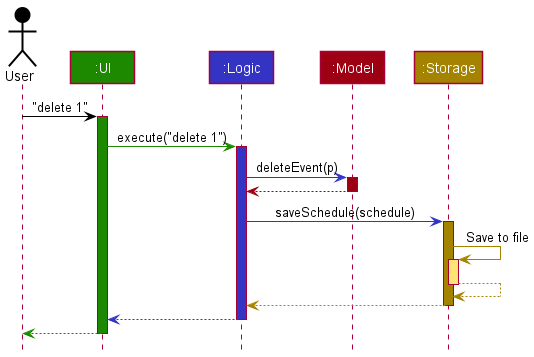


The `Logic` component defines its API in the `Logic.java` interface and implements its functionality using the `LogicManager.java` class which follows the `Logic` interface. Other components interact with a given component through its interface rather than the concrete class (in order to prevent outside components' from being coupled to the implementation of a component), as illustrated in the (partial) class diagram below.


The sections below give more details of each component.

### UI component

The **API** of this component is specified in [`Ui.java`](https://github.com/AY2122S1-CS2103T-T11-4/tp/blob/master/src/main/java/seedu/address/ui/Ui.java)

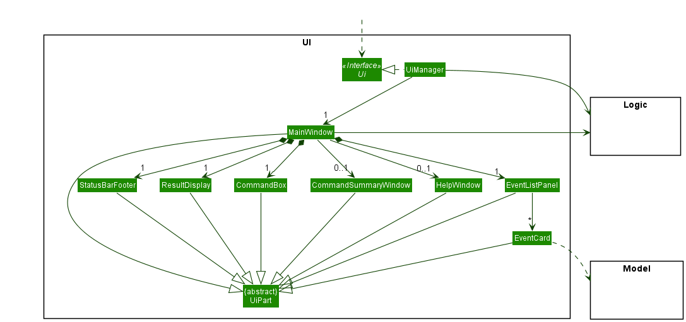

The UI consists of a `MainWindow` that is made up of parts e.g.`CommandBox`, `ResultDisplay`, `EventListPanel`, `StatusBarFooter` etc. All these, including the `MainWindow`, inherit from the abstract `UiPart` class which captures the commonalities between classes that represent parts of the visible GUI.

The `UI` component uses the JavaFx UI framework. The layout of these UI parts are defined in matching `.fxml` files that are in the `src/main/resources/view` folder. For example, the layout of the [`MainWindow`](https://github.com/AY2122S1-CS2103T-T11-4/tp/blob/master/src/main/java/seedu/address/ui/MainWindow.java) is specified in [`MainWindow.fxml`](https://github.com/AY2122S1-CS2103T-T11-4/tp/blob/master/src/main/resources/view/MainWindow.fxml)

The `UI` component,

* executes user commands using the `Logic` component.
* listens for changes to `Model` data so that the UI can be updated with the modified data.
* keeps a reference to the `Logic` component, because the `UI` relies on the `Logic` to execute commands.
* depends on some classes in the `Model` component, as it displays `Event` object residing in the `Model`.

### Logic component

The **API** of this component is specified in [`Logic.java`](https://github.com/AY2122S1-CS2103T-T11-4/tp/blob/master/src/main/java/seedu/address/logic/Logic.java)

Here's a (partial) class diagram of the `Logic` component:

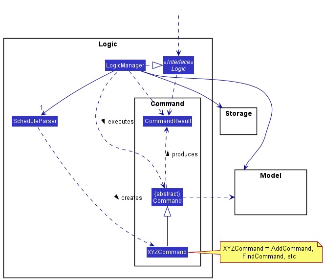

`Logic` is split into 2 packages, `Command` and `Parser`. This is how `Logic` works:
1. When `Logic` is called upon to execute a command, it uses the `ScheduleParser` class to parse the user command.
1. This results in a `Command` object (more precisely, an object of one of its subclasses e.g., `AddCommand`) which is executed by the `LogicManager`.
1. The command can communicate with the `Model` when it is executed (e.g. to add an event).
1. The result of the command execution is encapsulated as a `CommandResult` object which is returned back from `Logic`.

The Sequence Diagram below illustrates the interactions discussed above for the `execute("delete 1")` API call.


<div markdown="span" class="alert alert-info">:information_source: **Note:** The lifeline for `DeleteCommandParser` should end at the destroy marker (X) but due to a limitation of PlantUML, the lifeline reaches the end of diagram.
</div>

Here are the other classes in `Logic` (omitted from the earlier class diagram) that are used for parsing a user command:

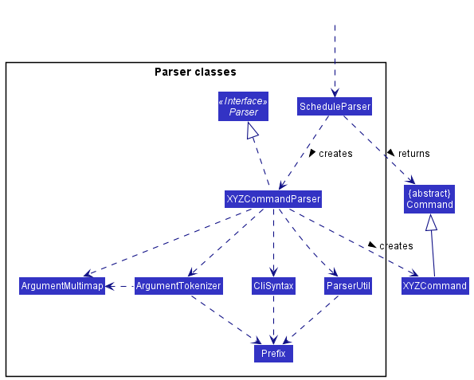

How the parsing works:
1. When called upon to parse a user command, the `ScheduleParser` class creates an `XYZCommandParser` (`XYZ` is a placeholder for the specific command name e.g., `AddCommandParser`) which uses the other classes shown above to parse the user command and create a `XYZCommand` object (e.g., `AddCommand`) which the `ScheduleParser` returns back as a `Command` object.
2. All `XYZCommandParser` classes (e.g., `AddCommandParser`, `DeleteCommandParser`, ...) inherit from the `Parser` interface so that they can be treated similarly where possible e.g, during testing.


### Model component
The **API** of this component is specified in [`Model.java`](https://github.com/AY2122S1-CS2103T-T11-4/tp/blob/master/src/main/java/seedu/address/model/Model.java)

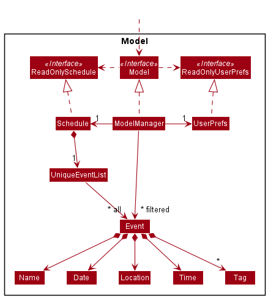


The `Model` component,

* stores the schedule data i.e., all `Event` objects (which are contained in a `SortEventList` object) and all `BlockedSlot` objects (which are contained in a `SortedBlockedSlotList`).
* stores the currently 'selected' `Event` objects (e.g., results of a search query) as a separate _filtered_ list which is exposed to outsiders as an unmodifiable `ObservableList<Event>` that can be 'observed' e.g. the UI can be bound to this list so that the UI automatically updates when the data in the list change.
* stores a `UserPref` object that represents the user’s preferences. This is exposed to the outside as a `ReadOnlyUserPref` objects.
* does not depend on any of the other three components (as the `Model` represents data entities of the domain, they should make sense on their own without depending on other components)

<div style="page-break-after: always;"></div>

<div markdown="span" class="alert alert-info">:information_source: **Note:** An alternative (arguably, a more OOP) model is given below. It has a `Tag` list in the `Schedule`, which `Event` references. This allows `Schedule` to only require one `Tag` object per unique tag, instead of each `Event` needing their own `Tag` objects.<br>

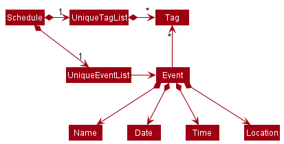

</div>


### Storage component

The **API** of this component is specified in [`Storage.java`](https://github.com/AY2122S1-CS2103T-T11-4/tp/blob/master/src/main/java/seedu/address/storage/Storage.java)

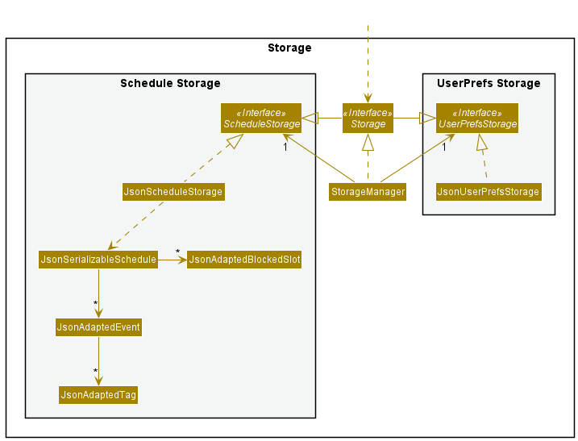

The `Storage` component,
* can _save_ both **schedule data** and **user preference data** in json format, and _read_ them back into corresponding objects.
* inherits from both `ScheduleStorage` and `UserPrefStorage`, which means it can be treated as either one (if only the functionality of only one is needed).
* depends on some classes in the `Model` component (because the `Storage` component's job is to save/retrieve objects that belong to the `Model`)

### Common classes

Classes used by multiple components are in the `seedu.address.commons` package.

--------------------------------------------------------------------------------------------------------------------

## **Implementation**

This section describes some noteworthy details on how certain features are implemented.

### SortedEventList

#### Description
The `SortedEventList` class provides an abstraction over an internal list of `Events`.
The `SortedEventList` supports minimal list operations including add, remove and set.
Duplicate Events are allowed in this Event list to accommodate repeated consultations with the same person.

#### Implementation
The `SortedEventList` class contains 2 fields, `internalList` and `internalUnmodifiableList`.

The `internalList` is an `ObservableArrayList` that is not sorted.

The `internalUnmodifiableList` is a `SortedList` that wraps around the `internalList` to maintain the sorted property of Events.
All changes in the `internalList` are propagated immediately to the SortedList.
An `EventComparator` class that implements the `Comparator` interface is created and used when constructing `SortedList`.

The `SortedEventList#asUnmodifiableObservableList()` method returns an ObservableList that the Ui can listen to display the list of consultations on the right.
This ObservableList will have its Events sorted chronologically.
This ObservableList is unmodifiable as part of defensive programming to prevent other classes from adding or deleting events from the ObservableList.

### List Free Slots Feature

#### Description
The List Free Slots Feature allows users to list down all free slots in the schedule from now
to 2359 of the day with the last event/blocked slot.

#### Implementation
This feature introduces a new command called `ListFreeSlotsCommand`.

The `ListFreeSlotsCommand` class has two fields `today` of type `Date` and `now` of type `LocalTime`. These fields are necessary to allow testing, where a specific date and time can be passed in to the `ListFreeSlotsCommand`.

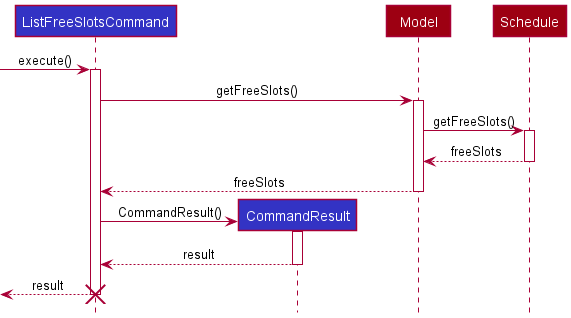

The `execute()` method calls `model#getFreeSlots()` which calls `schedule#getFreeSlots()`. This command does not update the model.
Instead a list of FreeSlot is returned. The `execute()` method then makes wraps this list of FreeSlot in a `CommandResult` to be displayed to user.

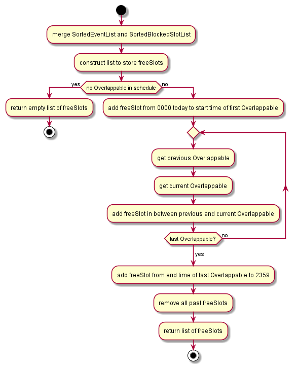

The `schedule#getFreeSlots()` method first combines the `SortedEventList` and the `SortedBlockedSlotList` into one list of Overlappables.

The `schedule#getFreeSlots()` method then iterates through this list of Overlappables to find free slots between events/blocked slots.

Finally, the `schedule#getFreeSlots()` method removes past freeSlot and returns a list of future freeSlots.

#### Design Considerations:

|   |Pros|Cons|
|---|---|---|
| Alternative 1: Implement FreeSlots as a special Event and store FreeSlots in the SortedEventList|Easy to list all free slots in the schedule by using a predicate to select only FreeSlots and updating the filteredList.|Adding, deleting and editing event will be harder as the corresponding FreeSlot at that timeslot will need to be deleted or edited. Only one list containing all Events, FreeSlots and BlockedSlots is allowed.|
| Alternative 2 (current): Go through the schedule each time the user uses the `list_free` command to find free slots|Easy to add, delete and edit events in SortedEventList. Easy to add additional lists such as SortedBlockedSlotList.|More computationally intensive as each time the user uses the `list_free` command, DukePro(f) will iterate through all events and blocked slots to find free slots in between.|

Alternative 2 is chosen to allow future implementations such as adding additional lists 
containing different types of events or commitments. 


### Today's Upcoming Events Feature
#### Description
This feature lists all the upcoming events scheduled for the current day excluding
the ongoing consultation event.

#### Implementation
The `UpcomingEventsCommand` class has one field timePredicate of type EventContainsCurrentTimePredicate.

`EventContainsCurrentTimePredicate` is  a class that checks whether an event's timeslot and date is after the current time and date.

The `UpcomingEventsCommand` utilizes the `updateFilteredEventList()` method in the `Model` class to return an updated filtered list of the upcoming events, filtered by the `timePredicate`.


The following sequence diagram illustrates the interactions discussed above for the execute("upcoming_events") API call:
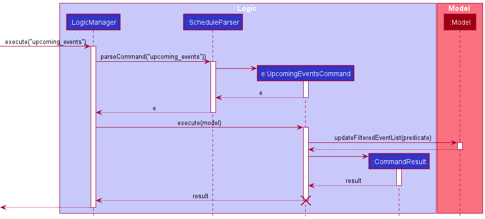

### Next Event Feature
#### Description
This feature displays the next event based on the current time in the schedule.

#### Implementation
The `NextEventCommand` class has one field timePredicate of type EventContainsCurrentTimePredicate.

`EventContainsCurrentTimePredicate` is  a class that checks whether an event's timeslot and date is after the current time and date.

The `NextEventCommand` utilizes the `updateFilteredEventList()` method in the `Model` class to return an updated filtered upcoming event that is filtered by the `timePredicate`.
Next, it gets the first event in the filtered list using the overridden method `nextEventInTheList()` found in the `ModelManager` class.


The following activity diagram summarizes what happens when a user executes the NextEventCommand:

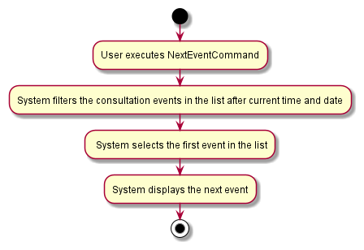

### Filter by Tag Feature
#### Description
This feature allows users to find all the consultation events whose tags contain any of the specified keywords (case-insensitive) and displays them as an indexed list.

#### Implementation
The `FilterByTagCommand` class has one field tagPredicate of type TagContainsKeywordsPredicate.

`TagContainsKeywordsPredicate`, found under `model/event` package, is  a class that checks whether an event's tag(s) matches any of the keyword(s) given.

The `FilterByTagCommand` utilizes the `updateFilteredEventList()` method in the `Model` class to return an updated filtered list of the events that have the specified tag. It is filtered by the `tagPredicate`.

The following sequence diagram illustrates the interactions discussed above for the execute("filter_tag URGENT") API call:
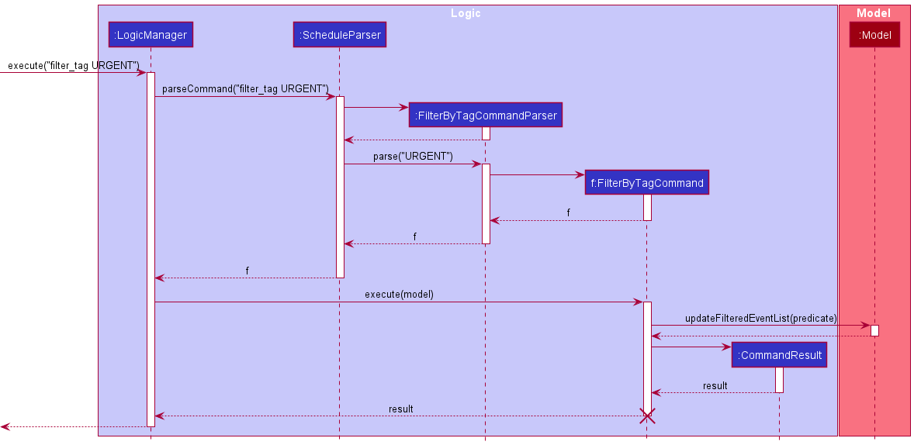

### Remark feature
#### Description

The remark feature is an optional description added to `Event`. It adds a remark to the
consultation event, and is stored internally as a `Remark` in `seedu.address.model.event.Event`.

#### Implementation

The `Remark` class has one field `value` of type String.

Unlike the other Objects in `Event`, all `Remark` inputs are valid, and hence do not need to check for Validity, unless the input is `null`.

There are two ways the remark can be added to an `Event`:
* `AddCommand(Event)` method  — Adds a new `Event` to the list (now with an optional remark description attached to it).
* `EditCommand(Event)` method — Edits the remark description of an existing `Event` on the list.

As a Remark is an optional input, if user does not input any remarks when adding a new event, the Remark will simply be stored as an empty String `””` in `Remark` in `Event` as default.

To display the remark in the GUI, a new `Label` called `remark` is added to `EventCard` as well as `EventListCard.fxml`.

### CommandSummary Command
#### Description

The `CommandSummaryCommand` class is a command that opens a pop-up window containing a Command Summary of DukePro(f)'s
possible commands.

#### Implementation

This implementation of this command adds another parameter `showCommands` (which has a default value of `false`) to the 
constructor of `CommandResult`.

When the command `command_summary` is input by the user, `LogicManager` parses the input and returns a 
`CommandSummaryCommand`. The `execute` method is called with the `showCommands` parameter being set to `true`. 
This causes `MainWindow` to execute the `handleCommandSummary` method, which opens the Command Summary Page.
### Block Feature
#### Description

The Block feature allows the user to block off a specified period of time so that it is not possible for a new `Event` to be created during that time slot.

#### Implementation

##### Model
The following class diagram illustrates the implementation of the Block feature.

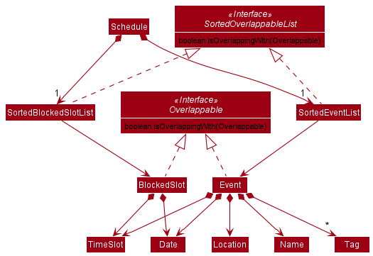

As shown in the class diagram, both `Event` and `BlockedSlot` implement the `Overlappable` interface. They also have their respective implementations of the `SortedOverlappableList` interface, `SortedEventList` and `SortedBlockedSlotList` respectively.
Every `Overlappable` is able to check if it overlaps with another `Overlappable`. This allows us to maintain a `SortedEventList` and a `SortedBlockedSlotList` in a `Schedule` and check against both lists when adding/editing an `Overlappable`.

##### Logic
The Block feature comes with the following new commands, they are quite self-explanatory:
1. `AddBlockedSlotCommand`
2. `ListBlockedSlotsCommand`
3. `DeleteBlockedSlotCommand`

Existing commands `AddCommand` and `EditCommand` also had to be edited(see below) to check for overlaps before adding/editing the `Event`.

The following steps describe the execution of an `AddCommand`(`EditCommand`follows similarly):
1. The `execute()` method of the `AddCommand` checks if the `Event` to be added overlaps with any items in the `Schedule`'s `SortedEventList` or `SortedBlockedSlotList`.
   1. If there is an overlap, a `SlotBlockedException`(which extends `CommandException`) is thrown, with an error message telling the user if the command was blocked by another event or a blocked slot.
   2. If there is no overlap, the new `Event` is added and the command succeeds.

##### Storage
These changes also needed a new `JsonAdaptedBlockedSlot` in order to save blocked slots 
created by the user into save file. 
`JsonSerializableSchedule` has a new field `blockedSlots`, which is a list of JsonAdaptedBlockedSlots. 
When `JsonScheduleStorage` reads the json file where the data is stored, it constructs a 
`JsonSerializableSchedule` based on the `events` and `blockedSlots` fields found in the json file, and 
then converts it to a `Schedule` object for DukePro(f) to access.
A new field `blockedSlots`, a `SortedBlockedSlotList`, is added to `Schedule` such that when it makes a copy of 
itself and then performs `Schedule#resetData()`, the blockedSlots data is not erased.

#### Design Considerations:

|   |Pros|Cons|
|---|---|---|
|Alternative 1: Have the `TimeSlot` class maintain a list of blocked time slots and prevent any new overlapping `TimeSlots` from being created.|Easy to implement. User is able to block out a specific time slot every day(e.g., 1800-1900 for dinner every day)|Does not work well with `FreeSlots` feature. User is unable to choose which days to have the blocked slot as it is applied to every day.|
|Alternative 2 (currently chosen): Implementation described above.|Code is easier to extend with more features. User is able to select the time slot and date to block.|More difficult to implement. More testing required. Blocked time slots will have to be added one by one.|

We originally intended for the user to block out a certain time slot for every day, making Alternative 1 a possibility, but we eventually decided that Alternative 2 will still be able to achieve this (although a little more effort is required) and is much more flexible.

--------------------------------------------------------------------------------------------------------------------

## **Documentation, logging, testing, configuration, dev-ops**

* [Documentation guide](Documentation.md)
* [Testing guide](Testing.md)
* [Logging guide](Logging.md)
* [Configuration guide](Configuration.md)
* [DevOps guide](DevOps.md)

--------------------------------------------------------------------------------------------------------------------

## **Appendix: Requirements**

### Product scope

**Target user profile**:

* is a professor in a university
* has a need to manage a significant number of commitments (i.e. lectures, tutorials, consultations)
* prefers desktop apps over other types
* can type fast
* prefers typing to mouse interactions
* is reasonably comfortable using CLI apps

**Value proposition**: manage daily commitments faster than a typical mouse/GUI driven app


### User stories

Priorities: High (must have) - `* * *`, Medium (nice to have) - `* *`, Low (unlikely to have) - `*`

| Priority | As a …​                                 | I want to …​                | So that I can…​                                                     |
| -------- | ------------------------------------------ | ------------------------------ | ---------------------------------------------------------------------- |
| `* * *`  | user                                       | add a consultation event       | easily record and remember consultation sessions with my students      |
| `* * *`  | user                                       | delete a consultation event    | forget about cancelled consultations and free up my timetable          |
| `* * *`  | user                                       | list out all my consultation events         | find out what is my next engagement                                    |
| `* * *`  | user                                       | list out all my free slots     | find a suitable slot to add a commitment                               |
| `* * *`  | user                                       | save all of my data I enter into the app    | view the data again the next time I open the app                       |
| `* * *`  | user with many commitments                 | ensure existing and to-be-added consultation events do not have timings that overlap      | make sure I don't have commitments that clash with each other |
| `* * *`  | busy user with many daily events           | search for a consultation event by name    | locate the details of events without going through the entire list     |
| `* * *`  | user                                       | block certain time slots       | reserve some private time for family/personal commitments              |
| `* * *`  | user                                       | unblock time slots I have previously blocked       | free time slots for consultations              |
| `* * *`  | user                                       | list out all the time slots I have previously blocked       | find out which time slots I cannot have consultations at because of existing commitments      |
| `* * *`  | meticulous user                            | add remarks to my events       | add additional details to my consultation events that I need to take note of   |
| `* * *`  | user                                       | edit a previously added event  | update changes in the details of my event                              |
| `* * *`  | user                                       | exit the app                   |                                                                        |
| `* *`    | user                                       | add tags to my consultation events          | group consultation events more easily                                                 |
| `* *`    | user                                       | I can filter my consultation events by tags  | I can find consultations with certain tags more easily |
| `* *`    | inexperienced user                         | bring up a link to access the product website | receive help regarding any problems I have with the app    |
| `* *`    | impatient user                             | clear the list of consultation events       | empty out my list of consultation events quickly instead of having to delete them one by one     |
| `* *`    | user                                       | list the upcoming consultation events in the day | take note of what I should make preparations for                  |
| `* *`    | user                                       | view the next upcoming consultation event   | find out what my next consultation event is                                   |
| `* *`    | new user                                   | have sample data in the app the first time I open it up | play around with the app easily |
| `* *`    | user                                       | print my schedule with censored details | send it to my students to see my available timings while maintaining confidentiality |
| `*`      | inexperienced user                         | see command usage instructions/examples| refer to the instructions to learn how to optimize my usage of the app |

### Use cases

For all use cases below, the **System** is the `DukePro(f)` and the **Actor** is the `User`, unless specified otherwise.

<pre>
<b>UC01: Delete an event</b>

<b>MSS</b>

1.  User requests to list events.
2.  The System shows the list of events.
3.  User requests to delete a specific event in the list.
4.  The System deletes the event.

    Use case ends.

<b>Extensions</b>

* 2a. The list is empty.

  Use case ends.

* 3a. The given index is invalid.

    * 3a1. The System shows an error message.

      Use case resumes at step 2.  
</pre>


<pre>
<b>UC02: Edit an event</b>

<b>MSS</b>

1. User requests to list events.
2. The System shows the list of events.
3. User requests to edit a specific event in the list and provides the 
   necessary information for the fields to edit.
4. The System shows the list of events, with the newly edited event.

<b>Extensions</b>

* 2a. The list is empty.

  Use case ends.

* 3a. The given index is invalid.

    * 3a1. The System shows an error message.

      Use case resumes at step 2.

* 3b. The given fields do not exist.

    * 3b1. The System shows an error message.

      Use case resumes at step 2.

* 3c. The given fields exist, but the given information is improperly formatted.

    * 3c1. The System shows an error message.

      Use case resumes at step 2.
</pre>

<pre>
<b>UC03: Search for an event</b>

<b>MSS</b>

1. User requests to search events.
2. The System shows a list of events which have the search term in their name.

<b>Extensions</b>

* 2a. No matches to the search term.

  *2a1. The System shows an empty list.

  Use case ends.
</pre>

<pre>
<b>UC04: Block slots</b>

<b>MSS</b>

1. User blocks out a time slot: 2021-11-01, 1800-1900.
2. User accidentally tries to key in a new event at the above time slot.
3. The System rejects the command and tells the User that the specified 
   time slot coincides with a blocked slot.

<b>Extensions</b>

* 1a. Time slot entered is already blocked.

  * 1a1. The System rejects the command and tells the User that the specified
         time slot coincides with a blocked slot.
  
  Use case ends.

* 1b. Time slot entered coincides with an event.

  * 1b1. The System rejects the command and tells the User that the specified 
         time slot coincides with an event.
  
  Use case ends.
</pre>

<pre>
<b>UC05: List all upcoming events for the day</b>

<b>MSS</b>

1. User requests to view today's upcoming consultation events.
2. DukePro(f) displays all the upcoming events.

   Use case ends.
    
<b>Extensions</b>

* 1a. User inputs the wrong format for the command.

  * 1a1. An error message telling the user that it's an unknown command.
    
    Use case ends.

* 1b. DukePro(f) has no upcoming consultation events.

  * 1b1. An empty events list is displayed with a message indicating that 
         there are 0 upcoming events.
  
    Use case ends.
</pre>

<pre>
<b>UC06: List the next consultation event for the day</b>

<b>MSS</b>

1. User requests to view the next consultation event.
2. DukePro(f) displays the next event.
    
   Use case ends.
    
<b>Extensions</b>

* 1a. User inputs the wrong format for the command.

  * 1a1. An error message telling the user that it's an unknown command.
    
    Use case ends.

* 1b. DukePro(f) has no events scheduled.

  * 1b1. An empty events list is displayed with a message indicating that 
         there are 0 events scheduled.
    
    Use case ends.
</pre>

<pre>
<b>UC07: Filter consultation events by tags</b>

 <b>MSS</b>

1. User requests to filter the consultation events by tag(s).
2. DukePro(f) displays the events that have the specified tag(s).
    
   Use case ends.
    
<b>Extensions</b>

* 1a. User inputs the wrong format for the command.

  * 1a1. An error message is displayed with the correct format.
    
    Use case ends.

* 1b. DukePro(f) has no consultation events that have the tag(s) specified.

  * 1b1. An empty events list is displayed with a with a message indicating 0 
         events are matched with the tags specified.
  
    Use case ends.
</pre>

### Non-Functional Requirements

1.  Should be able to hold up to 1000 events without a noticeable sluggishness in performance for typical usage.
2.  A user with above average typing speed for regular English text (i.e. not code, not system admin commands) should be able to accomplish most of the tasks faster using commands than using the mouse.
3.  The product should be for a single user.
4.  The data should be stored locally and should be in a human editable text file.
5.  The software should work on all Mainstream OS.
6.  The software should work without requiring an installer.
7.  Package everything into a single JAR file.
8.  The GUI should work well standard screen resolutions 1920x1080 and higher and for screen scales 100% and 125%.
9.  The GUI should be usable for resolutions 1280x720 and higher and for screen scales 150%.
10. The Developer Guide and User Guide should be PDF-friendly.
11. The product and its features should be testable under exam conditions.
12. Schedule should be displayed in an easy-to-read format.
13. JAR file should not exceed 100MB.
14. Document files should not exceed 15MB per file.


### Glossary
* **Event**: A consultation event with a student that a university professor has arranged to go for
* **Date**: Date of a consultation event
* **Index**: Unique index number of each consultation event
* **Location**: Location of the consultation event
* **Mainstream OS**: Windows, Linux, Unix, OS-X
* **Name**: A student's name for the respective consultation event
* **Remark**: Additional information about a consultation event
* **Schedule**: A list of events
* **Tag**: Additional label for the consultation event
* **TimeSlot**: Time period of a consultation event


--------------------------------------------------------------------------------------------------------------------

## **Appendix: Instructions for manual testing**

Given below are instructions to test the app manually.

<div markdown="span" class="alert alert-info">:information_source: **Note:** These instructions only provide a starting point for testers to work on;
testers are expected to do more *exploratory* testing.

</div>

### Launch and shutdown

1. Initial launch

   1. Download the jar file and copy into an empty folder.

   1. Double-click the jar file. 
    Expected:
<br>
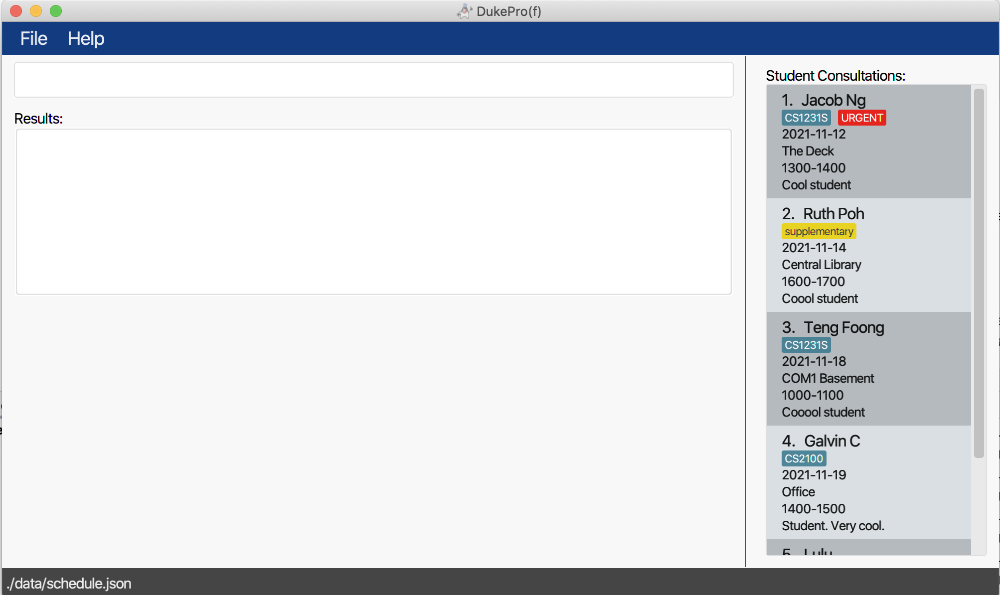
<br>
Shows the GUI with a set of sample events. The window size may not be optimum.

1. Saving window preferences

   1. Resize the window to an optimum size. Move the window to a different location. Close the window.

   1. Re-launch the app by double-clicking the jar file.<br>
       Expected: The most recent window size and location is retained.
      

### Deleting an event

1. Deleting an event while all events are being shown

   1. Prerequisites: List all events using the `list` command. Multiple events in the list.

   1. Test case: `delete 1`<br>
      Expected: First event is deleted from the list. Details of the deleted event shown in the status message. Timestamp in the status bar is updated.

   1. Test case: `delete 0`<br>
      Expected: No event is deleted. Error details shown in the status message. Status bar remains the same.

   1. Other incorrect delete commands to try: `delete`, `delete x`, `...` (where x is larger than the list 
   size)<br>
      Expected: Similar to previous.
      
### Saving data

1. Dealing with missing/corrupted/invalid `schedule.json` file in `data` directory
    1. Test case: missing `schedule.json` file<br>
       Expected:
       <br>
       
       <br>
New schedule with sample events.
   
2. Invalid data
    1. Test case `schedule.json` file with data:<br>
       ```missing```

    1. Test case `schedule.json` file with data with overlapping time slots:<br>
       ```
       {
         "events" : [ {
           "name" : "Jacob Ng",
           "date" : "2021-11-12",
           "startTime" : "1300",
           "endTime" : "1400",
           "location" : "The Deck",
           "tagged" : [ "URGENT", "CS1231S" ],
           "remark" : "Cool student"
         }, {
           "name" : "Ruth Poh",
           "date" : "2021-11-12",
           "startTime" : "1300",
           "endTime" : "1400",
           "location" : "Central Library",
           "tagged" : [ "supplementary" ],
           "remark" : "Coool student"
         } ],
         "blockedSlots" : [ ]
       }
       ```

    1. Test case `schedule.json` file with data with invalid fields:<br>
       ```
       { 
         "events" : [ { 
         "name" : "Jacob Ng", 
         "dat" : "2021-11-12", 
         "startTime" : "1300", 
         "endTime" : "1400", 
         "location" : "The Deck", 
         "tagged" : [ "URGENT", "CS1231S" ], 
         "remark" : "Cool student" 
         } ], 
         "blockedSlots" : [ ] 
       }
       ``` 
   Expected for test cases 1 to 3 above:
   <br>
   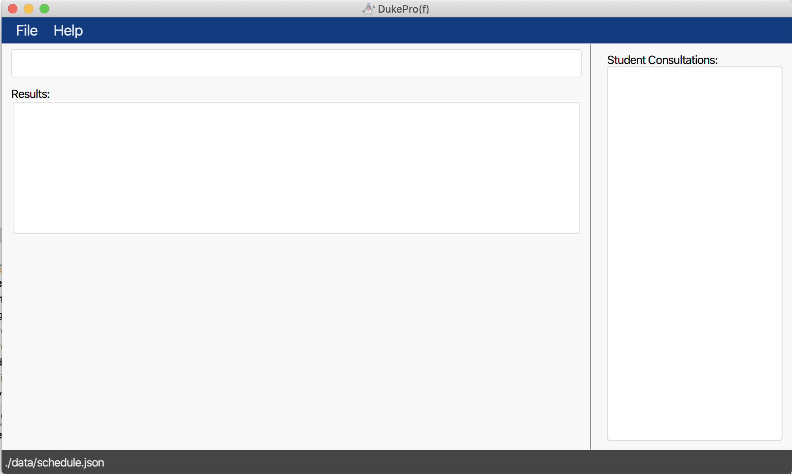
   <br>
Empty schedule.
