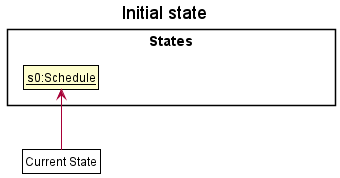
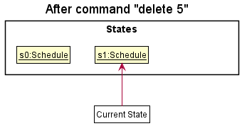
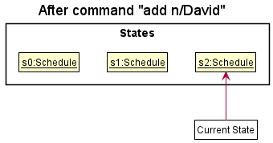
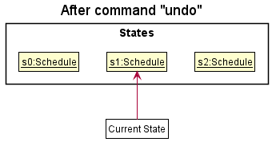
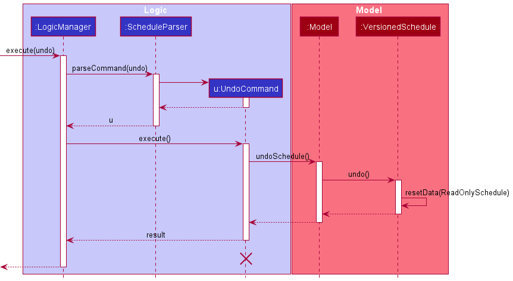
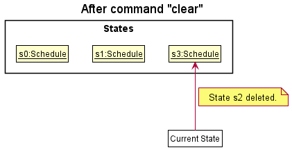

* Table of Contents
{:toc}

--------------------------------------------------------------------------------------------------------------------

## **Acknowledgements**

* {list here sources of all reused/adapted ideas, code, documentation, and third-party libraries -- include links to the original source as well}

--------------------------------------------------------------------------------------------------------------------

## **Setting up, getting started**

Refer to the guide [_Setting up and getting started_](SettingUp.md).

--------------------------------------------------------------------------------------------------------------------

## **Design**

:bulb: **Tip:** The `.puml` files used to create diagrams in this document can be found in the [diagrams](https://github.com/AY2122S1-CS2103T-T11-4/tp/tree/master/docs/diagrams) folder. Refer to the [_PlantUML Tutorial_ at se-edu/guides](https://se-education.org/guides/tutorials/plantUml.html) to learn how to create and edit diagrams.

### Architecture

The ***Architecture Diagram*** given above explains the high-level design of the App.

Given below is a quick overview of main components and how they interact with each other.

**Main components of the architecture**

**`Main`** has two classes called [`Main`](https://github.com/AY2122S1-CS2103T-T11-4/tp/blob/master/src/main/java/seedu/address/Main.java) and [`MainApp`](https://github.com/AY2122S1-CS2103T-T11-4/tp/blob/master/src/main/java/seedu/address/MainApp.java). It is responsible for,
* At app launch: Initializes the components in the correct sequence, and connects them up with each other.
* At shut down: Shuts down the components and invokes cleanup methods where necessary.

[**`Commons`**](#common-classes) represents a collection of classes used by multiple other components.

The rest of the App consists of four components.

* [**`UI`**](#ui-component): The UI of the App.
* [**`Logic`**](#logic-component): The command executor.
* [**`Model`**](#model-component): Holds the data of the App in memory.
* [**`Storage`**](#storage-component): Reads data from, and writes data to, the hard disk.

**How the architecture components interact with each other**

The *Sequence Diagram* below shows how the components interact with each other for the scenario where the user issues the command `delete 1`.

Each of the four main components (also shown in the diagram above),

* defines its *API* in an `interface` with the same name as the Component.
* implements its functionality using a concrete `{Component Name}Manager` class (which follows the corresponding API `interface` mentioned in the previous point.

For example, the `Logic` component defines its API in the `Logic.java` interface and implements its functionality using the `LogicManager.java` class which follows the `Logic` interface. Other components interact with a given component through its interface rather than the concrete class (reason: to prevent outside component's being coupled to the implementation of a component), as illustrated in the (partial) class diagram below.

The sections below give more details of each component.

### UI component

The **API** of this component is specified in [`Ui.java`](https://github.com/AY2122S1-CS2103T-T11-4/tp/blob/master/src/main/java/seedu/address/ui/Ui.java)

The UI consists of a `MainWindow` that is made up of parts e.g.`CommandBox`, `ResultDisplay`, `EventListPanel`, `StatusBarFooter` etc. All these, including the `MainWindow`, inherit from the abstract `UiPart` class which captures the commonalities between classes that represent parts of the visible GUI.

The `UI` component uses the JavaFx UI framework. The layout of these UI parts are defined in matching `.fxml` files that are in the `src/main/resources/view` folder. For example, the layout of the [`MainWindow`](https://github.com/AY2122S1-CS2103T-T11-4/tp/blob/master/src/main/java/seedu/address/ui/MainWindow.java) is specified in [`MainWindow.fxml`](https://github.com/AY2122S1-CS2103T-T11-4/tp/blob/master/src/main/resources/view/MainWindow.fxml)

The `UI` component,

* executes user commands using the `Logic` component.
* listens for changes to `Model` data so that the UI can be updated with the modified data.
* keeps a reference to the `Logic` component, because the `UI` relies on the `Logic` to execute commands.
* depends on some classes in the `Model` component, as it displays `Event` object residing in the `Model`.

### Logic component

**API** : [`Logic.java`](https://github.com/AY2122S1-CS2103T-T11-4/tp/blob/master/src/main/java/seedu/address/logic/Logic.java)

Here's a (partial) class diagram of the `Logic` component:

How the `Logic` component works:
1. When `Logic` is called upon to execute a command, it uses the `ScheduleParser` class to parse the user command.
1. This results in a `Command` object (more precisely, an object of one of its subclasses e.g., `AddCommand`) which is executed by the `LogicManager`.
1. The command can communicate with the `Model` when it is executed (e.g. to add an event).
1. The result of the command execution is encapsulated as a `CommandResult` object which is returned back from `Logic`.

The Sequence Diagram below illustrates the interactions within the `Logic` component for the `execute("delete 1")` API call.

:information_source: **Note:** The lifeline for `DeleteCommandParser` should end at the destroy marker (X) but due to a limitation of PlantUML, the lifeline reaches the end of diagram.

Here are the other classes in `Logic` (omitted from the class diagram above) that are used for parsing a user command:

How the parsing works:
* When called upon to parse a user command, the `ScheduleParser` class creates an `XYZCommandParser` (`XYZ` is a placeholder for the specific command name e.g., `AddCommandParser`) which uses the other classes shown above to parse the user command and create a `XYZCommand` object (e.g., `AddCommand`) which the `ScheduleParser` returns back as a `Command` object.
* All `XYZCommandParser` classes (e.g., `AddCommandParser`, `DeleteCommandParser`, ...) inherit from the `Parser` interface so that they can be treated similarly where possible e.g, during testing.

### Model component
**API** : [`Model.java`](https://github.com/AY2122S1-CS2103T-T11-4/tp/blob/master/src/main/java/seedu/address/model/Model.java)

The `Model` component,

* stores the schedule data i.e., all `Event` objects (which are contained in a `SortEventList` object).
* stores the currently 'selected' `Event` objects (e.g., results of a search query) as a separate _filtered_ list which is exposed to outsiders as an unmodifiable `ObservableList<Event>` that can be 'observed' e.g. the UI can be bound to this list so that the UI automatically updates when the data in the list change.
* stores a `UserPref` object that represents the user’s preferences. This is exposed to the outside as a `ReadOnlyUserPref` objects.
* does not depend on any of the other three components (as the `Model` represents data entities of the domain, they should make sense on their own without depending on other components)

:information_source: **Note:** An alternative (arguably, a more OOP) model is given below. It has a `Tag` list in the `Schedule`, which `Event` references. This allows `Schedule` to only require one `Tag` object per unique tag, instead of each `Event` needing their own `Tag` objects. 

### Storage component

**API** : [`Storage.java`](https://github.com/AY2122S1-CS2103T-T11-4/tp/blob/master/src/main/java/seedu/address/storage/Storage.java)

The `Storage` component,
* can save both schedule data and user preference data in json format, and read them back into corresponding objects.
* inherits from both `ScheduleStorage` and `UserPrefStorage`, which means it can be treated as either one (if only the functionality of only one is needed).
* depends on some classes in the `Model` component (because the `Storage` component's job is to save/retrieve objects that belong to the `Model`)

### Common classes

Classes used by multiple components are in the `seedu.address.commons` package.

--------------------------------------------------------------------------------------------------------------------

## **Implementation**

This section describes some noteworthy details on how certain features are implemented.

### SortedEventList - Galvin
#### Description
The `SortedEventList` class provides an abstraction over an internal list of `Events`. 

#### Implementation
The `SortedEventList` class contains 2 fields, `internalList` and `internalUnmodifiableList`.

The `internalList` is an `ObservableArrayList` that is not sorted.

The `internalUnmodifiableList` is a `SortedList` that wraps around the `internalList` to maintain the sorted property of Events

The `SortedEventList#asUnmodifiableObservableList()` method returns an ObservableList that `Schedule` uses as a field to store events. This ObservableList will have its Events sorted chronologically.

### Remark feature

#### Implementation

The remark feature is an optional description added to `Event`. It adds a remark to the
consultation event, stored internally as a `Remark` in `Event`.

There are two ways the remark is implemented:
* `AddCommand#remark()` — Adds a new `Event` to the list with a remark description attached to it.
* `EditCommand#remark` — Edits the remark description of an existing `Event` on the list.

Given below is an example usage scenario and how the remark feature behaves at each step.

Step 1. The user launches the application.

Step 2. The user executes `add n/Lulu Yousef d/2020-01-01 t/0800 l/NUS r/Wants to go through Tutorial 4.`

### \[Proposed\] Undo/redo feature

#### Proposed Implementation

The proposed undo/redo mechanism is facilitated by `VersionedSchedule`. It extends `Schedule` with an undo/redo history, stored internally as an `scheduleStateList` and `currentStatePointer`. Additionally, it implements the following operations:

* `VersionedSchedule#commit()` — Saves the current schedule state in its history.
* `VersionedSchedule#undo()` — Restores the previous schedule state from its history.
* `VersionedSchedule#redo()` — Restores a previously undone schedule state from its history.

These operations are exposed in the `Model` interface as `Model#commitSchedule()`, `Model#undoSchedule()` and `Model#redoSchedule()` respectively.

Given below is an example usage scenario and how the undo/redo mechanism behaves at each step.

Step 1. The user launches the application for the first time. The `VersionedSchedule` will be initialized with the initial schedule state, and the `currentStatePointer` pointing to that single schedule state.

Step 2. The user executes `delete 5` command to delete the 5th event in the schedule. The `delete` command calls `Model#commitSchedule()`, causing the modified state of the schedule after the `delete 5` command executes to be saved in the `scheduleStateList`, and the `currentStatePointer` is shifted to the newly inserted schedule state.

Step 3. The user executes `add n/David …​` to add a new event. The `add` command also calls `Model#commitSchedule()`, causing another modified schedule state to be saved into the `scheduleStateList`.

:information_source: **Note:** If a command fails its execution, it will not call `Model#commitSchedule()`, so the schedule state will not be saved into the `scheduleStateList`.

Step 4. The user now decides that adding the event was a mistake, and decides to undo that action by executing the `undo` command. The `undo` command will call `Model#undoSchedule()`, which will shift the `currentStatePointer` once to the left, pointing it to the previous schedule state, and restores the schedule to that state.

:information_source: **Note:** If the `currentStatePointer` is at index 0, pointing to the initial Schedule state, then there are no previous Schedule states to restore. The `undo` command uses `Model#canUndoSchedule()` to check if this is the case. If so, it will return an error to the user rather
than attempting to perform the undo.

The following sequence diagram shows how the undo operation works:

:information_source: **Note:** The lifeline for `UndoCommand` should end at the destroy marker (X) but due to a limitation of PlantUML, the lifeline reaches the end of diagram.

The `redo` command does the opposite — it calls `Model#redoSchedule()`, which shifts the `currentStatePointer` once to the right, pointing to the previously undone state, and restores the schedule to that state.

:information_source: **Note:** If the `currentStatePointer` is at index `scheduleStateList.size() - 1`, pointing to the latest schedule state, then there are no undone Schedule states to restore. The `redo` command uses `Model#canRedoSchedule()` to check if this is the case. If so, it will return an error to the user rather than attempting to perform the redo.

Step 5. The user then decides to execute the command `list`. Commands that do not modify the schedule, such as `list`, will usually not call `Model#commitSchedule()`, `Model#undoSchedule()` or `Model#redoSchedule()`. Thus, the `scheduleStateList` remains unchanged.

Step 6. The user executes `clear`, which calls `Model#commitSchedule()`. Since the `currentStatePointer` is not pointing at the end of the `scheduleStateList`, all schedule states after the `currentStatePointer` will be purged. Reason: It no longer makes sense to redo the `add n/David …​` command. This is the behavior that most modern desktop applications follow.

The following activity diagram summarizes what happens when a user executes a new command:

#### Design considerations:

**Aspect: How undo & redo executes:**

* **Alternative 1 (current choice):** Saves the entire schedule.
  * Pros: Easy to implement.
  * Cons: May have performance issues in terms of memory usage.

* **Alternative 2:** Individual command knows how to undo/redo by
  itself.
  * Pros: Will use less memory (e.g. for `delete`, just save the event being deleted).
  * Cons: We must ensure that the implementation of each individual command are correct.

_{more aspects and alternatives to be added}_

### \[Proposed\] Data archiving

_{Explain here how the data archiving feature will be implemented}_

--------------------------------------------------------------------------------------------------------------------

## **Documentation, logging, testing, configuration, dev-ops**

* [Documentation guide](Documentation.md)
* [Testing guide](Testing.md)
* [Logging guide](Logging.md)
* [Configuration guide](Configuration.md)
* [DevOps guide](DevOps.md)

--------------------------------------------------------------------------------------------------------------------

## **Appendix: Requirements**

### Product scope

**Target user profile**:

* is a professor in a university
* has a need to manage a significant number of commitments (i.e. lectures, tutorials, consultations)
* prefer desktop apps over other types
* can type fast
* prefers typing to mouse interactions
* is reasonably comfortable using CLI apps

**Value proposition**: manage daily commitments faster than a typical mouse/GUI driven app

### User stories

Priorities: High (must have) - `* * *`, Medium (nice to have) - `* *`, Low (unlikely to have) - `*`

| Priority | As a …​                                 | I want to …​                | So that I can…​                                                     |
| -------- | ------------------------------------------ | ------------------------------ | ---------------------------------------------------------------------- |
| `* * *`  | user                                       | add a consultation event       | easily record and remember consultation sessions with my students      |
| `* * *`  | user                                       | delete a consultation event    | forget about cancelled consultations and free up my timetable          |
| `* * *`  | user                                       | list out all my events         | find out what is my next engagement                                    |
| `* * *`  | user                                       | list out all my free slots     | find a suitable slot to add a commitment                               |
| `* * *`  | user                                       | save all the data entered      | view the data again the next time I open the app                       |
| `* * *`  | busy user with many daily events           | search for an event by name    | locate the details of events without going through the entire list     |
| `* * *`  | user                                       | block certain time slots       | reserve some private time for family/personal commitments              |
| `* * *`  | meticulous user                            | add remarks to my events       | add details that I need to make preparations for before the event      |
| `* * *`  | user                                       | edit a previously added event  | update changes in the details of my event                              |
| `* * *`  | user                                       | exit the app                   |                                                                        |
| `* *`    | user                                       | add tags to my events          | group them more easily                                                 |
| `* *`    | new user                                   | click a link to access the product website | receive help regarding any problems I have with the app    |
| `* *`    | user                                       | clear the list of events       | empty out everything quickly instead of deleting them one by one       |
| `* *`    | user                                       | list the upcoming events in the day | take note of what I should make preparations for                  |
| `* *`    | user                                       | view the next upcoming event   | find out what is my next engagement                                    |
| `* *`    | user                                       | print my schedule with censored details | send it to my students to see my available timings while maintaining confidentiality |
| `*`      | new user                                   | see usage instructions/examples| refer to the instructions to learn how to optimize my usage of the app |

### Use cases

(For all use cases below, the **System** is the `DukePro(f)` and the **Actor** is the `user`, unless specified otherwise)

**Use case: Delete an event**

**MSS**

1.  User requests to list events
2.  DukePro(f) shows the list of events
3.  User requests to delete a specific event in the list
4.  DukePro(f) deletes the event

    Use case ends.

**Extensions**

* 2a. The list is empty.

  Use case ends.

* 3a. The given index is invalid.

    * 3a1. DukePro(f) shows an error message.

      Use case resumes at step 2.

**Use case: Edit an event**

**MSS**

1. User requests to list events
2. DukePro(f) shows the list of events
3. User requests to edit a specific event in the list and provides the necessary information for the fields to edit
4. DukePro(f) shows the list of events, with the newly edited event

**Extensions**

* 2a. The list is empty.

  Use case ends.

* 3a. The given index is invalid.

    * 3a1. DukePro(f) shows an error message.

      Use case resumes at step 2.

* 3b. The given fields do not exist.

    * 3b1. DukePro(f) shows an error message.

      Use case resumes at step 2.

* 3c. The given fields exist, but the given information is improperly formatted.

    * 3c1. DukePro(f) shows an error message.

      Use case resumes at step 2.

**Use case: Search for an event**

**MSS**

1. User requests to search events
2. DukePro(f) shows a list of events which have the search term in their name

**Extensions**

* 2a. No matches to the search term

  *2a1. DukePro(f) shows an empty list

  Use case ends.

### Non-Functional Requirements

1.  Should be able to hold up to 1000 events without a noticeable sluggishness in performance for typical usage.
2.  A user with above average typing speed for regular English text (i.e. not code, not system admin commands) should be able to accomplish most of the tasks faster using commands than using the mouse.
3.  The product should be for a single user.
4.  The data should be stored locally and should be in a human editable text file.
5.  The software should work on all Mainstream OS.
6.  The software should work without requiring an installer.
7.  Package everything into a single JAR file.
8.  The GUI should work well standard screen resolutions 1920x1080 and higher and for screen scales 100% and 125%.
9.  The GUI should be usable for resolutions 1280x720 and higher and for screen scales 150%.
10. The Developer Guide and User Guide should be PDF-friendly.
11. The product and its features should be testable under exam conditions.
12. Schedule should be displayed in an easy-to-read format.
13. JAR file should not exceed 100MB.
14. Document files should not exceed 15MB per file.

*{More to be added}*

### Glossary

* **Mainstream OS**: Windows, Linux, Unix, OS-X
* **Event**: A period of time to be blocked off
* **Date**: Date of event
* **Time**: Time of event
* **Location**: Location of event
* **Name**: Name of event
* **Index**: Unique index number of each event
* **Tag**: Additional information about an event
* **Schedule**: A list of events

[comment]: <> (* **Note**: Detailed description of an event)
[comment]: <> (* **Slot**: A period of time that is free)

--------------------------------------------------------------------------------------------------------------------

## **Appendix: Instructions for manual testing**

Given below are instructions to test the app manually.

:information_source: **Note:** These instructions only provide a starting point for testers to work on;
testers are expected to do more *exploratory* testing.

### Launch and shutdown

1. Initial launch

   1. Download the jar file and copy into an empty folder

   1. Double-click the jar file Expected: Shows the GUI with a set of sample events. The window size may not be optimum.

1. Saving window preferences

   1. Resize the window to an optimum size. Move the window to a different location. Close the window.

   1. Re-launch the app by double-clicking the jar file. 
       Expected: The most recent window size and location is retained.

1. _{ more test cases …​ }_

### Deleting an event

1. Deleting an event while all events are being shown

   1. Prerequisites: List all events using the `list` command. Multiple events in the list.

   1. Test case: `delete 1` 
      Expected: First event is deleted from the list. Details of the deleted event shown in the status message. Timestamp in the status bar is updated.

   1. Test case: `delete 0` 
      Expected: No event is deleted. Error details shown in the status message. Status bar remains the same.

   1. Other incorrect delete commands to try: `delete`, `delete x`, `...` (where x is larger than the list size) 
      Expected: Similar to previous.

1. _{ more test cases …​ }_

### Saving data

1. Dealing with missing/corrupted data files

   1. _{explain how to simulate a missing/corrupted file, and the expected behavior}_

1. _{ more test cases …​ }_
