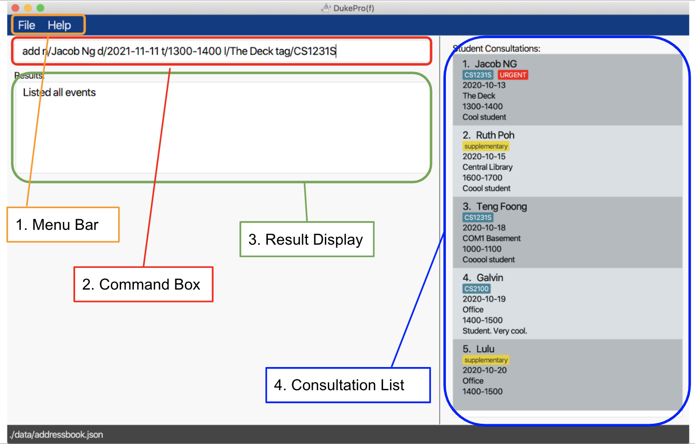

## Introduction
***

DukePro(f) is a schedule-planning desktop application that assists **university professors** in managing
their **consultations**, through the usage of an intuitive **Command-Line Interface (CLI)**1
and an easy-to-navigate Graphical User Interface (GUI)2.

Amidst long hours of lectures and tutorials in the week, professors may still need to cater timeslots for student
consultations, which can be hard to come by and difficult to keep track of. This is where Dukepro(f)
comes in to help you out! 

With DukePro(f), you will be able to:

* Add, edit, and delete your consultations
* List all of your consultations, or just your next consultation
* List your free time slots for consultation booking
* Block certain time slots to ensure your consultations don't clash with other commitments
* List all of the time slots that you've blocked so far
* And many more!

It is named `DukePro(f)` (Duke-Professor) because our project's target audience is professors, and it is also a nod
to our CS2103T iP (individual Project), which was named `Duke`.

1Command-Line Interface (CLI): How you interact with the application, i.e. by 
typing in text (commands).
2Graphical User Interface (GUI): The visual component of DukePro(f), and the form by which you 
interact with it.

## Table of Contents
***

* TOC
{:toc}

## 2. Purpose
***

This document is the User Guide for DukePro(f). It is intended to provide all the necessary information to use this software.
The manual assumes that the user has the ability to type fast and prefers typing over other means of input.
This User Guide contains the following sections:
1. Command Summary (TODO HYPERLINKS)
2. Quick Start
3. Commands and their Features
4. FAQ

## 2. Meaning of icons and textboxes

:bulb: Tells you additional info in form of small tips!

 :information_source: Tells you things to take note of 
while using DukePro(f)!

:warning: Warns you of errors that should be 
avoided! 

## 3. Command Summary
***

Action | Format | Examples
--------|-------|-------
**[Add](#51-adding-a-consultation-event--add)** | `add n/NAME d/DATE t/TIMESLOT l/LOCATION [tag/TAG]... [r/REMARK]` | `add n/Lulu Yousef d/2020-01-01 t/0800-0900 l/NUS tag/Important tag/Supplementary`
**[Add Blocked Time Slots]** | `block d/DATE t/TIMESLOT` | `block d/2020-01-01 t/0800-0900`
**[Clear](#52-clearing-all-consultation-events--clear)** | `clear`  | -
**[Delete](#53-deleting-a-consultation-event--delete)** | `delete INDEX` | `delete 3`
**[Delete Blocked Time Slots]** | `delete_blocked INDEX` | `delete_blocked 1`
**[Display Next Event](#58-displaying-the-next-consultation-event--next_event)** | `next_event` | -
**[Edit](#54-editing-a-consultation-event--edit)** | `edit INDEX [n/NAME] [d/DATE] [t/TIMESLOT] [l/LOCATION] [tag/TAG]... [r/REMARK]`  | `edit 2 n/Quan Teng Foong`   `edit 6 tag/Zoom Meeting`
**[Filter By Tags]** | `filter_tag TAG_NAME [MORE_TAG_NAMES]...` |
**[Find](#55-finding-a-consultation-event--find)** | `find KEYWORD [MORE_KEYWORDS]...` | `find Teng Foong`
**[List](#57-listing-all-consultation-events--list)** | `list` | -
**[List Blocked Time Slots]** | `list_blocked` | -
**[List Free Time Slots]** | `list_free` | -
**[List Upcoming Events](#59-listing-all-upcoming-events--upcoming_events)** | `upcoming_events` | -
**[Help](#56-viewing-help--help)** | `help` | -
**[View Command Summary](#510-viewing-the-command-summary-page--command_summary)** | `command_summary` | -
**[Exit](#511-exiting-the-app--exit)** | `exit` | -

## 4. Quick Start
***
1. Ensure you have Java `11` or above installed in your Computer. 

:bulb: **Tip:**
   Not sure how? Click [here](https://www.codejava.net/java-se/download-and-install-java-11-openjdk-and-oracle-jdk)!

2. Download the latest `dukeprof.jar` from [here](https://github.com/AY2122S1-CS2103T-T11-4/tp/releases).

3. Copy the file to the folder you want to use as the _home folder_ (the folder where you want to store the
   application and its data) for your DukePro(f).

4. Double-click the file to start the app. A GUI similar to the image below should appear in a few seconds. 
   Note how the app contains some sample data. 
   

5. Refer to our [Tutorial on How To Use DukePro(f)] to start typing commands.
   
6. Refer to the [Features](#3-features) for details of each command.

## 4. How To Use DukePro(f): A Quick Tutorial

Here are the different parts of DukePro(f)'s GUI:

 

Step 1: Type the desired command into the Command Box and press `ENTER`. 
 

 

Step 2: Check the Result Display to see if your command is successful.
 

 

Step 3: Check the Consultation List to see if your consultation event has been added.
 

Some other commands you can try:

* **`list`** 
  Lists all of your consultation events.

* **`add`** `add n/Galvin Chan d/2020-07-07 t/1000-1100 l/NUS tag/Tutorial 4` 
  Adds a consultation event for `Galvin Chan`, at date `2020-07-07`, time `1000-1100`, 
  at location `NUS`, and tagged with `Tutorial 4` to DukePro(f).

* **`delete`** `delete 3` 
  Deletes the 3rd consultation event on your consultation list.

## 5. Commands and their Features
***

**:information_source: Notes about the command format:** 

* Words in `UPPER_CASE` are the parameters to be supplied by the user. 
  * e.g. in `add n/NAME`, `NAME` is a parameter which can be used as `add n/Lulu Yousef`.

* Items in square brackets are optional. (Items not in square brackets are necessary!)
  * e.g. `[tag/TAG]` is an optional parameter.

* Parameters that can have more than one entry will be anteceded by a `...`
  * e.g. `[tag/TAG]...` can have more than one entry, so `tag/supplmentary tag/important` is accepted.

* Parameters can be in any order. 
  * e.g. if the command specifies `n/NAME d/DATE`, `d/DATE n/NAME` is also acceptable.

* If a parameter is expected only once in the command, but you have specified it multiple times, only the 
  last occurrence of the parameter will be taken. 
  * e.g. if you specify `t/0100 t/2359`, only `t/2359` will be taken.

* Extraneous parameters for commands that do not take in parameters (such as `list` and `exit`) will be 
  ignored. 
  * e.g. if the command specifies `list 123`, it will be interpreted as `list`.

### 5.1: Managing Your Consultations
Listed below are the commands for managing your consultations.

### 5.1.1 Adding a Consultation Event : `add`

Adds a consultation event to Dukepro(f).

Format: `add n/NAME d/DATE t/TIMESLOT l/LOCATION [tag/TAG]... [r/REMARK]`
* tags with the text "URGENT" and "supplementary" will automatically be changed to red and yellow respectively to
  enable the user to indicate the consultation's severity

:bulb: **Tip:**
A consultation event can have any number of tags (including 0).

Example(s):
* `add n/Lulu Yousef d/2020-01-01 t/0800-0900 l/NUS tag/Important tag/supplementary`
* `add n/Ruth Poh d/2020-02-02 t/1000-1100 l/The Deck r/May have to switch to zoom`
* `tag/URGENT` will be shown as 
* `tag/supplementary` will be shown as 

### 5.3 Deleting a Consultation Event : `delete`

Deletes a consultation event from DukePro(f) at the specified `INDEX`.

Format: `delete INDEX`

Example(s):
* `delete 1`

### 5.4 Editing a Consultation Event : `edit`

Edits the details of a consultation event from DukePro(f) at the specified `INDEX`.

Format: `edit INDEX [n/NAME] [d/DATE] [t/TIMESLOT] [l/LOCATION] [tag/TAG]... [r/REMARK]`

:bulb: **Warning**: Editing the tags will automatically 
erase all previous tags!

Example(s):
* `edit 2 n/Ruth t/0730-0830`
* `edit 3 r/May have to switch to zoom`

### 5.7 Listing all Consultation Events : `list`
Lists down all consultation events scheduled in DukePro(f).

Format: `list`

### 5.8 Displaying the next Consultation Event : `next_event`
Displays the next consultation event scheduled for the day in DukePro(f).

Format: `next_event`

### 5.9 Listing all Upcoming Events : `upcoming_events`
Lists down all the upcoming consultation events for the current day.

Format: `upcoming_events`

### 5.2 Clearing all Consultation Events : `clear`

Clears all consultation events stored in DukePro(f).

:warning: **WARNING**: This command cannot be reversed. Be 
careful when using this command!

Format: `clear`

### 5.5 Finding a Consultation Event : `find`
Finds all consultation events whose names contain any of the specified keywords and displays them as an indexed list.

Format: `find KEYWORD [MORE_KEYWORDS]...`

:warning: **WARNING**: The keywords are case-insensitive, but 
won't register unless the full word of the keyword is inputted. E.g.:
* `find Jacob` can return a consultation event with the name `Jacob` but `find Jac` cannot return an event with the name 
`Jacob`
* `find Jacob` can return a consultation event with the name `Jacob Ng`
* `find jacob` and `find jAcOb` can return a consultation event with the name `Jacob`

Example(s):
* `find Jacob`

### 5.5 Filtering Consultation Events By Tags : `filter_tag`
Finds all consultation events whose tags contain any of the specified tag names (case-insensitive) and displays them as 
an indexed list.
Format: `filter_tag TAG_NAME [MORE_TAG_NAMES]...`

:warning: **WARNING**: The tag names have the 
usage warnings as finding consultation events does! 

Example(s):
* `filter_tag URGENT`

### 5.2: Managing Your Blocked Time Slots
Listed below are the commands for managing your blocked time slots.

### 5.1.1 Adding a Blocked Time Slot : `block`

Adds a blocked time slot to Dukepro(f).

Format: `add d/DATE t/TIMESLOT`

Example(s):
* `add n/Lulu Yousef d/2020-01-01 t/0800-0900 l/NUS tag/Important tag/supplementary`
* `add n/Ruth Poh d/2020-02-02 t/1000-1100 l/The Deck r/May have to switch to zoom`
* `tag/URGENT` will be shown as 
* `tag/supplementary` will be shown as 

### 5.3: Help Commands
Listed below are the commands if you're stuck on how to use DukePro(f).

### 5.3.1 Viewing help : `help`

Opens a pop-up window with a link to DukePro(f)'s user guide.

Format: `help`

### 5.3.2 Viewing the Command Summary Page: `command_summary`
Opens a pop-up window with a Command Summary of all of DukePro(f)'s possible commands.

Format: `command_summary`

### 5.4: Exiting the app : `exit`

Exits DukePro(f).

Format: `exit`

### 5.5 Saving all edits
Event data is automatically saved into the hard disk after any command that changes the data. There is no
need to save manually.

## 6. FAQ
***
**Q**: Where are the releases? 
**A**: You can download the latest `dukeprof.jar` from [here](https://github.
com/AY2122S1-CS2103T-T11-4/tp/releases)!

**Q**: How do I transfer my data to another Computer? 
**A**: Install the app in the other computer, and overwrite the empty data file it creates with the file 
that contains the data of your previous DukePro(f) home folder.

**Q**: Where are the releases? 
**A**: You can download the latest `dukeprof.jar` from [here](https://github.
com/AY2122S1-CS2103T-T11-4/tp/releases)!

**Q**: The dukeprof.jar isn’t opening when I double-click it. 
**A**: 
If you're using Windows, click here for a tutorial video.
If you're using Mac, click here for a tutorial video.
If you're using Linux, click here for a tutorial video.
