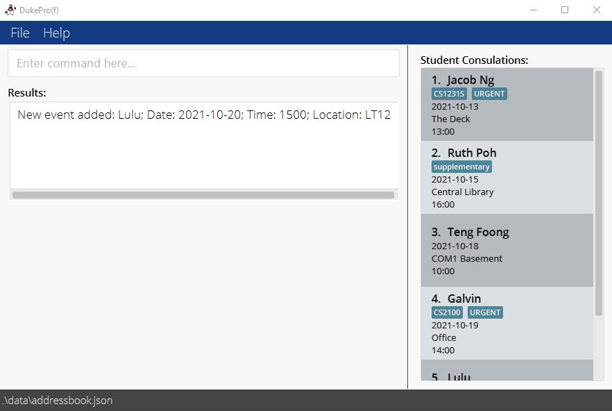
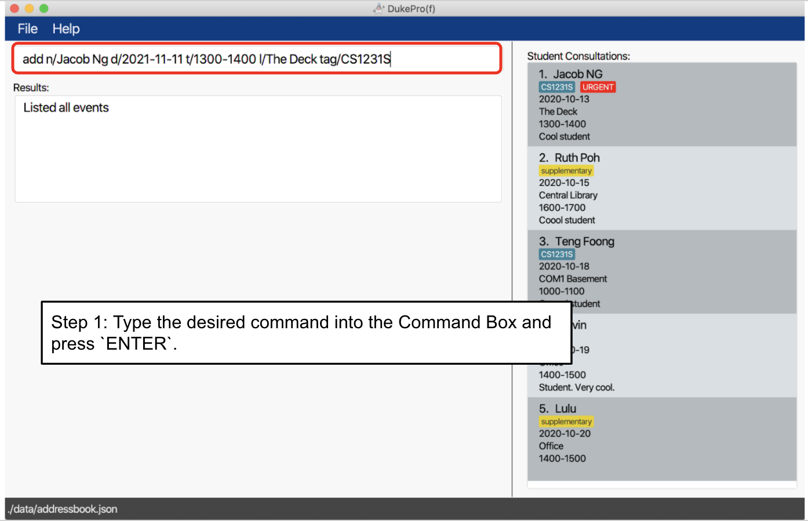
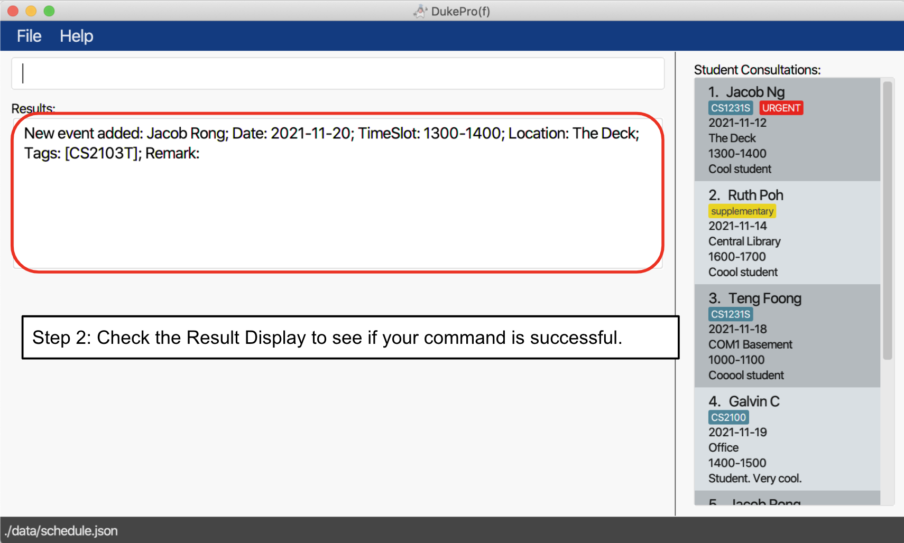
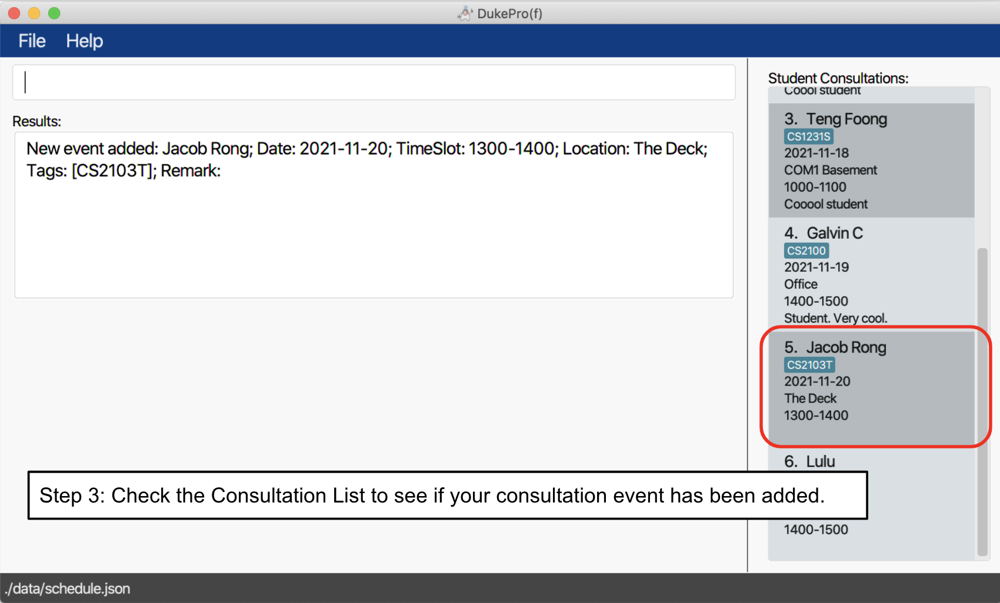

  

## **Introduction**
***

DukePro(f) is a schedule-planning desktop application that assists **university professors** in managing
their **consultations**, through the usage of an intuitive **Command-Line Interface (CLI)**1
and an easy-to-navigate **Graphical User Interface (GUI)**2.

It is named `DukePro(f)` (Duke-Professor) because our project's target audience is professors, and it is also a nod
to our CS2103T iP (individual Project), which was named `Duke`.

Amidst long hours of lectures and tutorials in the week, professors may still need to cater timeslots for student
consultations, which can be hard to come by and difficult to keep track of. This is where Dukepro(f)
comes in to help you out! 

With DukePro(f), you will be able to:

* Add, edit, and delete your consultations
* List all of your consultations, or just your next consultation
* List your free time slots for consultation booking
* Block certain time slots to ensure your consultations don't clash with other commitments
* And many other small quality of life features!

1Command-Line Interface (CLI): How you interact with the application, i.e. by 
typing in text (commands). 
2Graphical User Interface (GUI): The visual component of DukePro(f), and the form by which you 
interact with it.

## **Table of Contents**
***
* Table of Contents
{:toc}
  

## **1. Purpose**
***

This document is the User Guide for DukePro(f). It is intended to provide all the necessary information to use this software.
The manual assumes that the user has the ability to type fast and prefers typing over other means of input.
This User Guide contains the following sections:
* [1. Purpose of the User Guide](#1-purpose)
* [2. Meaning of Icons and Textboxes](#2-meaning-of-icons-and-textboxes)
* [3. Quick Start: Get Started Using DukePro(f)](#3-quick-start-get-started-using-dukeprof)
* [4. Command Summary: A Summary of Commands for DukePro(f)](#4-command-summary-a-summary-of-commands-for-dukeprof)
* [5. Commands and their Features](#5-commands-and-their-features)
* [6. FAQ](#6-faq)

## **2. Meaning of Icons and Textboxes**
***

:bulb: Tells you additional info in form of small tips.

 :information_source: Tells you things to take note of 
while using DukePro(f).

:warning: Warns you of errors that should be 
avoided.

## **3. Quick Start: Get Started Using DukePro(f)**
***
### 3.1 Downloading and Opening the App

1. Ensure you have Java `11` or above installed in your Computer. 
    
:bulb: **Tip:**
     Not sure how? Click [here](https://www.codejava.net/java-se/download-and-install-java-11-openjdk-and-oracle-jdk)!
    

2. Download the latest `dukeprof.jar` from [here](https://github.com/AY2122S1-CS2103T-T11-4/tp/releases).

3. Copy the file to the folder you want to use as the _home folder_ (the folder where you want to store the
   application and its data) for your DukePro(f).

4. Double-click the file to start the app. A GUI similar to the image below should appear in a few seconds. 
   Note that the app will contain some sample data. 
   
    
   
:bulb: **Tip:**
   Facing issues? Refer to [6. FAQ](#6-faq) for help. 
   

   
5. Refer to our [tutorial](#32-how-to-use-dukeprof-a-quick-tutorial) on how to use DukePro(f) to start 
   typing commands.
   
6. Refer to the [Commands and their Features](#5-commands-and-their-features) section for details on each 
   command.

### 3.2 How To Use DukePro(f): A Quick Tutorial

These are the different parts of DukePro(f)'s GUI:

   

Here's how to add a consultation event to DukePro(f):
 

 
Step 1: Type the desired command into the Command Box and press `ENTER`. 

 

 
Step 2: Check the Result Display to see if your command is successful. 

 

 
Step 3: Check the Consultation List to see if your consultation event has been added. 

Here are some other commands you can try:

* **`list`** 
  Lists all of your consultation events in the Consultation List box.

* **`add`** `add n/Galvin Chan d/2021-11-01 t/1000-1100 l/NUS tag/Tutorial4` 
  Adds a consultation event for `Galvin Chan`, at date `2021-11-01`, time `1000-1100`, 
  at location `NUS`, and tagged with `Tutorial4` to DukePro(f).

* **`delete`** `delete 3` 
  Deletes the 3rd consultation event on your consultation list.

## **4. Command Summary: A Summary of Commands for DukePro(f)**
***
Listed below are the commands that DukePro(f) supports, in alphabetical order:

Action | Format | Example(s)
--------|-------|-------
**[Add](#51-adding-a-consultation-event--add)** | `add n/NAME d/DATE t/TIMESLOT l/LOCATION [tag/TAG]... [r/REMARK]` | `add n/Lulu Yousef d/2021-11-11 t/0800-0900 l/NUS tag/Important tag/supplementary r/May switch to Zoom`
**[Add Blocked Time Slots](#511-adding-a-blocked-time-slot--block)** | `block d/DATE t/TIMESLOT` | `block d/2021-11-12 t/0800-0900`
**[Clear](#57-clearing-all-consultation-events--clear)** | `clear`  | -
**[Delete](#52-deleting-a-consultation-event--delete)** | `delete INDEX` | `delete 3`
**[Delete Blocked Time Slots](#512-deleting-a-blocked-time-slot--delete_blocked)** | `delete_blocked INDEX` | `delete_blocked 1`
**[Display Next Event](#55-displaying-the-next-consultation-event--next_event)** | `next_event` | -
**[Edit](#53-editing-a-consultation-event--edit)** | `edit INDEX [n/NAME] [d/DATE] [t/TIMESLOT] [l/LOCATION] [tag/TAG]... [r/REMARK]`  | `edit 2 n/Quan Teng Foong`   `edit 6 tag/ZoomMeeting`
**[Exit](#516-exiting-the-app--exit)** | `exit` | -
**[Filter By Tags](#59-filtering-consultation-events-by-tags--filter_tag)** | `filter_tag TAG_NAME [MORE_TAG_NAMES]...` | `filter_tag URGENT`
**[Find](#58-finding-a-consultation-event--find)** | `find KEYWORD [MORE_KEYWORDS]...` | `find Teng Foong`
**[Help](#514-viewing-help--help)** | `help` | -
**[List](#54-listing-all-consultation-events--list)** | `list` | -
**[List Blocked Time Slots](#513-listing-all-blocked-time-slots--list_blocked)** | `list_blocked` | -
**[List Free Time Slots](#510-listing-all-free-time-slots--list_free)** | `list_free` | -
**[List Upcoming Events](#56-listing-all-upcoming-events--upcoming_events)** | `upcoming_events` | -
**[View Command Summary](#515-viewing-the-command-summary-page-command_summary)** | `command_summary` | -

## **5. Commands and Their Features**
***

**:information_source: Notes about the command format:** 

* Words in `UPPER_CASE` are parameters to be supplied by the user. 
  * E.g. In `add n/NAME`, `NAME` is a parameter which can be used as `add n/Lulu Yousef`.

* Items in square brackets are optional. (Items not in square brackets are necessary!)
  * E.g. `[tag/TAG]` is an optional parameter.

* Parameters that can have more than one entry will be anteceded by a `...`
  * E.g. `[tag/TAG]...` can have more than one entry, so `tag/supplmentary tag/important` is accepted.

* Parameters can be in any order. 
  * E.g. If the command specifies `n/NAME d/DATE`, `d/DATE n/NAME` is also acceptable.

* If a parameter is expected only once in the command, but you have specified it multiple times, only the 
  last occurrence of the parameter will be taken. 
  * E.g. If you specify `d/2021-11-11 d/2021-11-21`, only `d/2021-11-21` will be taken.

* Extraneous parameters for commands that do not take in parameters (such as `list` and `exit`) will be 
  ignored. 
  * E.g. If the command specifies `list 123`, it will be interpreted as `list`.

* Entries for `n/NAME` and `tag/TAG` must be alphanumeric. 
  * E.g. `n/Poh Hui-En Ruth` will not be accepted as it has a hyphen in it.

* Entries for `d/DATE` must be in the format YYYY-MM-DD.

* Entries for `t/TIMESLOT` must be in the 24h format of HHmm-HHmm and must be a time slot between 0000 and 
  2359 (inclusive). 
  * E.g. `t/2300-0000` will not be accepted as the time passes over to a new day.
  
* Tags cannot span more than one word.
  * E.g. `tag/URGENT` will be accepted but not `tag/URGENT MATTER`.

* Tags with the text "URGENT" and "supplementary" have special tag colours to enable the user to indicate
  the consultation's severity (these tag names are case-sensitive!). 
  * `tag/URGENT` will be shown as 
  * `tag/supplementary` will be shown as 

***
### Managing Your Consultations
Listed below are the commands for managing your consultations.
Consultation events listed in the Consultation List are sorted in chronological order, earliest 
consultation at the top, and latest consultation at the bottom. All consultations, existing and 
to-be-added, events cannot overlap.

Listed is a description of the various fields of a Consultation Event:
* NAME: Name of student involved in the consultation
* DATE: Date the consultation occurs
* TIMESLOT: Start and end time consultation occurs
* LOCATION: Location of consultation
* TAG: Any group that the consultation belongs to (commonly used in conjunction with the `filter_tag` command)
* REMARK: Any additional details of the consultation

### 5.1 Adding a Consultation Event : `add`

Adds a consultation event to Dukepro(f).

Format: `add n/NAME d/DATE t/TIMESLOT l/LOCATION [tag/TAG]... [r/REMARK]`

:bulb: **Tip:**
A consultation event can have any number of tags (including 0).

Example(s):
* `add n/Lulu Yousef d/2021-01-12 t/0800-0900 l/NUS tag/CS2103T tag/supplementary` 
  Adds a consultation event for `Lulu Yousef`, at date `12 Jan 2021` and time `8am to 9am`,
  at location `NUS`, tagged with `CS2103T` and `supplementary`.
* `add n/Ruth Poh d/2021-03-02 t/1300-1400 l/The Deck r/May have to switch to zoom` 
  Adds a consultation event for `Ruth Poh`, at date `2 Mar 2021` and time `1pm to 2pm`,
  at location `The Deck`, with the remark `May have to switch to zoom`.

### 5.2 Deleting a Consultation Event : `delete`

Deletes a consultation event from DukePro(f) at the specified `INDEX`.

Format: `delete INDEX`

:warning: **WARNING:** This command deletes according to the 
index of the Consultation List on the right hand side of the application, i.e., if the list has been filtered 
with the `find` command, `delete 1` will delete the first consultation event in the filtered list, and not 
the complete list of consultation events. 

Example(s):
* `delete 2`
  
* Deletes the second consultation event indexed in the Consultation List. 

### 5.3 Editing a Consultation Event : `edit`

Edits the details of a consultation event in DukePro(f) at the specified `INDEX`.

Format: `edit INDEX [n/NAME] [d/DATE] [t/TIMESLOT] [l/LOCATION] [tag/TAG]... [r/REMARK]`

:warning: **WARNING:**
 * Editing the tags will automatically erase all previous tags!
 * This command edits according to the index of the Consultation List on the right hand side of the 
application, i.e., if the list has been filtered with the `find` command, `edit 1 n/Ruth` will edit the first 
consultation event in the filtered list, and not the complete list of consultation events. 

Example(s):
* `edit 2 n/Ruth t/0730-0830` 
  Edits the name of the second consultation event indexed in the Consultation List to `Ruth` and the 
  TimeSlot to 
  `0730-0830`.
* `edit 3 r/May have to switch to Zoom.` 
  Edits the remark of the third consultation event indexed in the Consultation list to `May have to switch to Zoom.`

### 5.4 Listing all Consultation Events : `list`
Lists all consultation events in the Consultation List.

Format: `list`

### 5.5 Displaying the next Consultation Event : `next_event`
Displays the next consultation event scheduled for the day in the Consultation List.

 :information_source: 
**Tip:** If you are currently in the middle of an existing consultation event, DukePro(f) will list the next 
event after the current consultation event.

Format: `next_event`

### 5.6 Listing all Upcoming Events : `upcoming_events`
Displays all upcoming consultation events for the current day in the Consultation List.

 :information_source: 
**Tip:** This will not include the current ongoing consultation event.

Format: `upcoming_events`

### 5.7 Clearing all Consultation Events : `clear`

Clears all consultation events from DukePro(f).

:warning: **WARNING:** This command cannot be reversed. Be 
careful when using this command!

Format: `clear`

### 5.8 Finding a Consultation Event : `find`
Finds all consultation events whose names contain any of the specified keywords and displays them 
as an indexed list in the Consultation List.
* Keywords are case-insensitive.

Format: `find KEYWORD [MORE_KEYWORDS]...`

:warning: **WARNING**: The keywords will not register unless 
the full word of the keyword is inputted and search per one word only. E.g.:
 * `find Jacob` can return a consultation event with the name `Jacob` but `find Jac` cannot return an 
event with the name 
`Jacob`
 * `find Jacob` can return a consultation event with the name `Jacob Ng`
 * `find jacob` and `find jAcOb` can return a consultation event with the name `Jacob`
 * `find Jacob R` can return a consultation event with the name `Jacob Ng`, `R Ng` and `Jacob Ong` but 
not `Jacob Rong`

Example(s):
* `find Jacob`

  Finds all consultation events that have students with the name `Jacob` (or any case-insensitive variant) 
  and displays them in the Consultation List.

### 5.9 Filtering Consultation Events By Tags : `filter_tag`
Finds all consultation events whose tags contain any of the specified tag names (case-insensitive) and displays them as 
an indexed list in the Consultation List.
Format: `filter_tag TAG_NAME [MORE_TAG_NAMES]...`

:warning: **WARNING**: The tag names will not register unless 
the full word of the tag name is inputted and search per one word only. E.g.:
 * `filter_tag URGENT` can return a consultation event tagged `URGENT` but `filter_tag URG` 
cannot return a consultation event tagged `URGENT`
 * `filter_tag URGENT` can return a consultation event tagged `urgent`

Example(s):
* `filter_tag URGENT` 
  Finds all consultation events that contain the tag `URGENT` and displays them in the Consultation List.

### 5.10 Listing all Free Time Slots : `list_free`
Lists down all free time slots from now until 2359 of the day with the last event or blocked slot in the 
Result Display.

Format: `list_free`

 :information_source: 
**Tip:** An empty schedule i.e. with 0 events and 0 blocked slots in the schedule, will not have any free 
slots displayed.

 

***
### Managing Your Blocked Time Slots
Listed below are the commands for managing your blocked time slots.
Blocked time slots ensure that you will not be able to add consultation events during those time slots.

### 5.11 Adding a Blocked Time Slot : `block`
Adds a blocked time slot to Dukepro(f).

Format: `block d/DATE t/TIMESLOT`

Example(s):
* `block d/2021-01-01 t/0800-0900`
  Blocks the time slot `8am to 9am` on `January 1, 2021`.
* `block d/2021-02-02 t/1000-1100`
  Blocks the time slot `10am to 11am` on `February 2, 2021`.

### 5.12 Deleting a Blocked Time Slot : `delete_blocked`
Deletes a blocked time slot from the list of blocked time slots at the specified `INDEX`.

Format: `delete_blocked INDEX`

Example(s):
* `delete_blocked 1` 
  Deletes the first blocked time slot from the list of blocked time slots.

### 5.13 Listing all Blocked Time Slots : `list_blocked`
Lists all blocked time slots in the Result Display.

Format: `list_blocked`

 

***
### Help Commands
Listed below are the commands you can use to guide you in case you're stuck.

### 5.14 Viewing help : `help`
Opens a pop-up window with a link to DukePro(f)'s user guide.

Format: `help`

### 5.15 Viewing the Command Summary Page: `command_summary`
Opens a pop-up window with a Command Summary of all of DukePro(f)'s possible commands.

Format: `command_summary`
 

***
### 5.16: Editing the data file
DukePro(f) data is all saved as a JSON file in `[JAR file location]/data/schedule.json`. Advanced users are 
welcome to update data directly by editing that data file.

:bulb: **WARNING**: If any changes to the data file 
make its format invalid, DukePro(f) will discard all data and start with an empty data file at the next run.

### 5.17: Exiting the app : `exit`

Exits DukePro(f).

Format: `exit`

## **6. FAQ**
***
**Q**: Where are the releases? 
**A**: You can download the latest `dukeprof.jar` from
 [here](https://github.com/AY2122S1-CS2103T-T11-4/tp/releases)!

**Q**: How do I transfer my DukePro(f) data into another Computer? 
**A**: Install the DukePro(f) into the other computer (if you're forgotten how, [click here]
(#3-quick-start-get-started-using-dukeprof)). Then, in your previous computer, go to 
the home folder of DukePro(f), go into the`data` folder, and copy the `schedule.json` file and transfer it 
into the respective (empty) `data` folder in your current computer.

**Q**: How do I save my edits? 
**A**: All data is automatically saved into the hard disk after any command that changes the data. There is no
need to save manually.

**Q**: The dukeprof.jar isn’t opening when I double-click it. Please help? 
**A**: 
If you're using Windows, [click here](https://www.youtube.com/watch?v=ifBlevULGtM) for a tutorial video. 
If you're using Mac, [click here](https://www.youtube.com/watch?v=WkTt70O6SwI&ab_channel=CS.Math.Educator) for a tutorial video. 
If you're using Linux, [click here](https://www.youtube.com/watch?v=oIMX8qcdvSA) for a tutorial video. 
